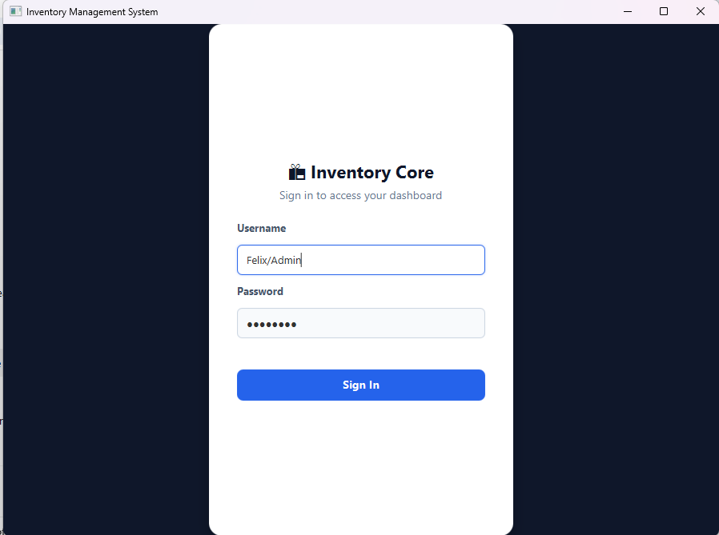
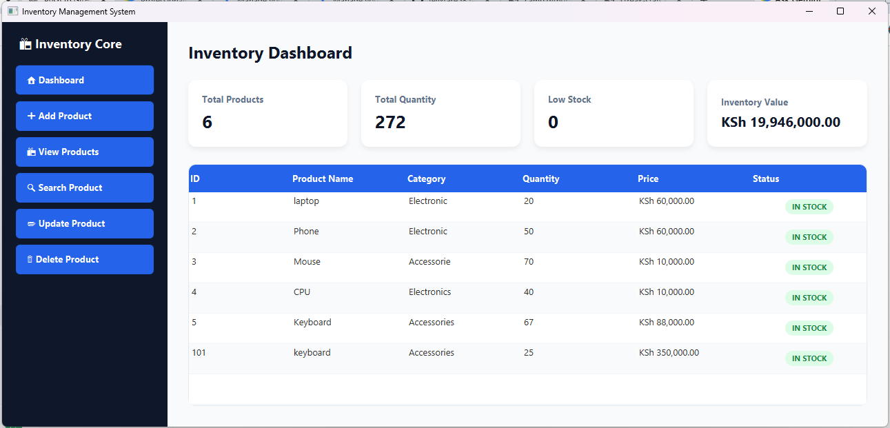
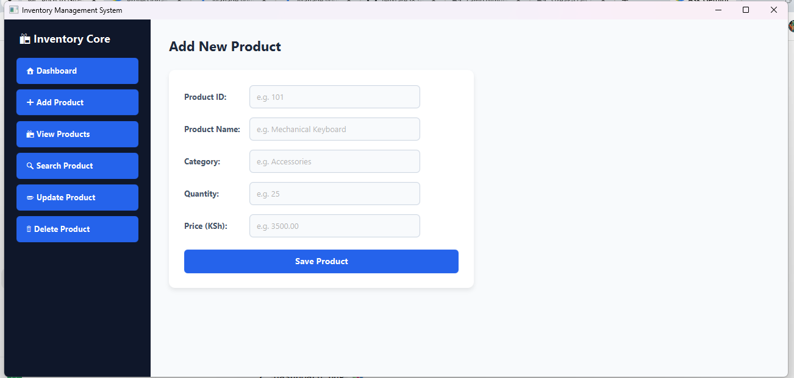
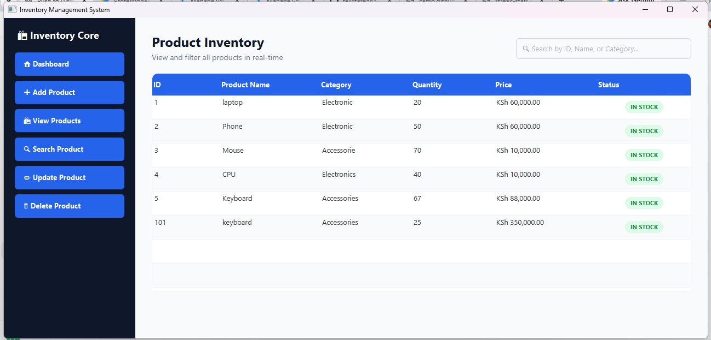
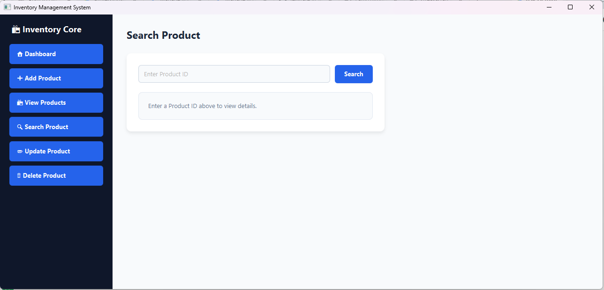
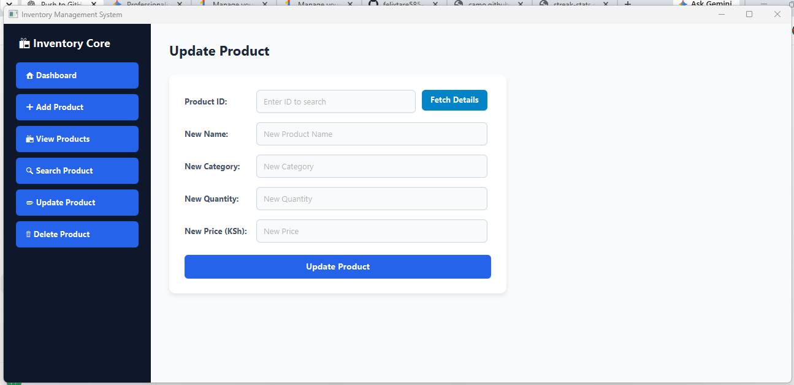
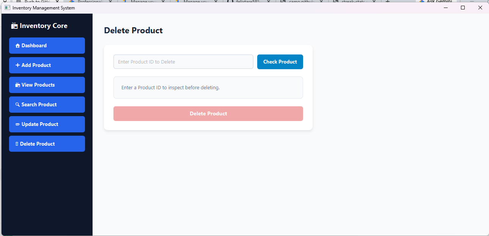

# Inventory Management System

A desktop-based Inventory Management System built using JavaFX and MySQL.

This application allows users to manage products through a graphical user interface with database storage using JDBC.

## Features

- User Authentication & Login Screen
- Real-time Inventory Dashboard with Key Metrics
- Add new products
- View all products
- Search products by ID, Name, or Category
- Update product details
- Delete products with confirmation dialogs
- MySQL database integration
- JavaFX graphical user interface

---

## Screenshots

### 🔑 Login Screen


### 📊 Inventory Dashboard


### ➕ Add Product


### 📋 View Products


### 🔍 Search Product


### ✏️ Update Product


### 🗑️ Delete Product


---

## Technologies Used

- Java 17
- JavaFX 21
- MySQL Database
- JDBC
- Maven
- Git & GitHub

## Project Structure

```text
InventoryManagementSystem
│
├── .github
├── screenshots
│   ├── 01login.png
│   ├── 02dashboard.png
│   ├── 03addproducts.png
│   ├── 04view_product.png
│   ├── 05search_product.png
│   ├── 06update_product.png
│   └── 07delete_product.png
│
├── pom.xml
│
└── src
    └── main
        └── java
            └── com.inventory
                │
                ├── Main.java
                │
                ├── controllers
                │   └── ProductController.java
                │
                ├── database
                │   └── DatabaseConnection.java
                │
                ├── models
                │   └── Product.java
                │
                └── views
                    ├── AddProduct.java
                    ├── ViewProducts.java
                    ├── SearchProduct.java
                    ├── UpdateProduct.java
                    └── DeleteProduct.java

                    How To Run
Clone the repository:

Bash
git clone [https://github.com/felixtare585-gif/InventoryManagementSystem.git](https://github.com/felixtare585-gif/InventoryManagementSystem.git)
Configure MySQL database connection:
Update database credentials inside DatabaseConnection.java.

Open the project in VS Code or IntelliJ IDEA.

Run the application:

Bash
mvn javafx:run
Author
Felix Tare